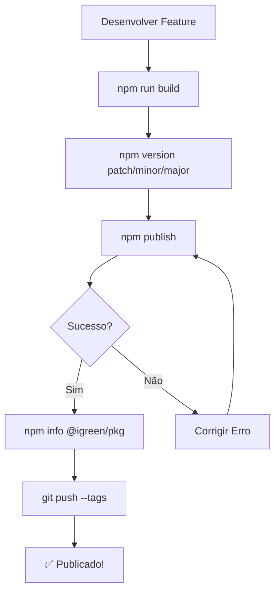

# 📦 Tutorial: Versionamento e Publicação

> Como versionar e publicar componentes no NPM público

---

## 🎯 Visão Geral

Este tutorial cobre o fluxo completo:
1. Versionar componente (Semver)
2. Build do pacote
3. Publicar no NPM público
4. Verificar publicação
5. Testar instalação

---

## 📋 Pré-requisitos

### 1. Conta NPM

```bash
# Fazer login no NPM
npm login

# Verificar
npm whoami
```

### 2. Autenticação 2FA (Recomendado)

Se tiver 2FA habilitado, tenha o app autenticador pronto.

### 3. Pacote Pronto

- Código finalizado
- Tests passando
- Build funcionando

---

## 🔢 Semver (Versionamento Semântico)

### Formato: `MAJOR.MINOR.PATCH`

```
1.2.3
│ │ └─ PATCH: Bug fixes (1.2.3 → 1.2.4)
│ └─── MINOR: Novas features retrocompatíveis (1.2.3 → 1.3.0)
└───── MAJOR: Breaking changes (1.2.3 → 2.0.0)
```

### Comandos NPM

```bash
# Patch (1.0.0 → 1.0.1)
npm version patch

# Minor (1.0.0 → 1.1.0)
npm version minor

# Major (1.0.0 → 2.0.0)
npm version major
```

---

## 🚀 Fluxo Completo de Publicação

### Passo 1: Preparar Componente

```bash
cd packages/components/shadcn/button

# Verificar que está tudo OK
npm run build
```

### Passo 2: Versionar

```bash
# Se for bug fix
npm version patch

# Se for nova feature
npm version minor

# Se for breaking change
npm version major
```

Isso vai:
- ✅ Atualizar `package.json`
- ✅ Criar commit git
- ✅ Criar tag git

### Passo 3: Publicar

```bash
npm publish
```

Durante a publicação:
- Pode pedir código 2FA
- Pode abrir navegador para autenticação
- Aguarde mensagem: `+ @igreen/button@x.x.x`

### Passo 4: Verificar

```bash
# Ver info do pacote
npm info @igreen/button

# Ver versões disponíveis
npm view @igreen/button versions
```

### Passo 5: Testar Instalação

```bash
# Em outro projeto
npm install @igreen/button@latest
```

---

## 📝 Exemplo Prático: Publicar Button v1.0.2

### Cenário: Corrigir bug no Button

```bash
# 1. Ir para o pacote
cd packages/components/shadcn/button

# 2. Fazer as correções no código
# ... editar src/button.tsx ...

# 3. Build
npm run build

# 4. Versionar (patch pois é bug fix)
npm version patch
# package.json: 1.0.1 → 1.0.2

# 5. Publicar
npm publish
# Aguardar: + @igreen/button@1.0.2

# 6. Verificar
npm info @igreen/button
```

---

## 🔄 Publicar Múltiplos Pacotes

### Usando Script Automático

```bash
# Na raiz do projeto
npm run publish:all
```

Isso publica **todos** os pacotes em ordem de dependência:
1. Themes
2. Utils
3. Componentes
4. Design System

### Publicar com Filtro

```bash
# Apenas componentes shadcn
npm run publish:all -- --filter shadcn

# Apenas um componente específico
npm run publish:all -- --filter button
```

---

## 🏷️ Versões Pre-release

### Beta

```bash
# Criar versão beta
npm version prerelease --preid=beta
# 1.0.0 → 1.0.1-beta.0

# Publicar com tag
npm publish --tag beta
```

Instalar beta:
```bash
npm install @igreen/button@beta
```

### Release Candidate

```bash
npm version prerelease --preid=rc
# 1.0.0 → 1.0.1-rc.0

npm publish --tag rc
```

---

## 📦 Publicar Novo Componente

### Primeira Publicação

```bash
cd packages/components/shadcn/my-new-component

# 1. Garantir que package.json está correto
cat package.json
# {
#   "name": "@igreen/my-new-component",
#   "version": "1.0.0",
#   "publishConfig": {
#     "access": "public",
#     "registry": "https://registry.npmjs.org"
#   }
# }

# 2. Build
npm run build

# 3. Publicar
npm publish

# 4. Verificar
npm info @igreen/my-new-component
```

---

## 🔧 Atualizar Dependências Entre Pacotes

### Exemplo: Button depende de Themes v1.3.0

```bash
# 1. Publicar themes primeiro
cd packages/themes
npm version minor  # 1.2.0 → 1.3.0
npm run build
npm publish

# 2. Atualizar button para usar nova versão
cd ../components/shadcn/button

# Editar package.json:
{
  "dependencies": {
    "@igreen/themes": "^1.3.0"  // ← Atualizar
  }
}

# 3. Instalar nova dependência
npm install

# 4. Versionar e publicar button
npm version patch
npm run build
npm publish
```

---

## ✅ Checklist de Publicação

### Antes de Publicar

- [ ] Código revisado
- [ ] Tests passando
- [ ] Build funcionando (`npm run build`)
- [ ] package.json correto (nome, versão, publishConfig)
- [ ] Dependências atualizadas
- [ ] CHANGELOG.md atualizado (opcional)

### Durante Publicação

- [ ] Logado no NPM (`npm whoami`)
- [ ] Versão atualizada (`npm version`)
- [ ] Publicado (`npm publish`)
- [ ] 2FA confirmado (se necessário)

### Após Publicação

- [ ] Verificado no NPM (`npm info`)
- [ ] Testado instalação (`npm install`)
- [ ] Tag Git criada
-  [ ] Commit pushado (`git push --tags`)

---

## 🚨 Troubleshooting

### "You cannot publish over the previously published versions"

**Causa:** Tentando publicar versão que já existe

**Solução:**
```bash
# Bump a versão
npm version patch

# Publicar nova versão
npm publish
```

### "You do not have permission to publish"

**Causa:** Não está logado ou não tem permissão

** Solução:**
```bash
npm login
npm whoami
```

### "402 Payment Required - You must sign up for private packages"

**Causa:** Pacote está configurado como privado

**Solução:**

Editar `package.json`:
```json
{
  "publishConfig": {
    "access": "public"  // ← Deve ser "public"
  }
}
```

### "Authentication Error - 2FA Required"

**Causa:** Conta tem 2FA mas não foi fornecido código

**Solução:**
- Digite código do app autenticador quando solicitado
- OU abra URL fornecida no navegador

---

## 📊 Comandos de Referência

| Comando | Descrição |
|---------|-----------|
| `npm version patch` | Incrementa PATCH (1.0.0 → 1.0.1) |
| `npm version minor` | Incrementa MINOR (1.0.0 → 1.1.0) |
| `npm version major` | Incrementa MAJOR (1.0.0 → 2.0.0) |
| `npm publish` | Publicar no NPM |
| `npm publish --tag beta` | Publicar com tag beta |
| `npm info @igreen/button` | Ver info do pacote |
| `npm view @igreen/button versions` | Listar versões |
| `npm dist-tag add @igreen/button@1.0.0 latest` | Marcar como latest |

---

## 🎯 Boas Práticas

### 1. Sempre Build Antes de Publicar

```bash
npm run build
npm publish
```

### 2. Usar Conventional Commits

```bash
git commit -m "fix: corrigir padding do button"
git commit -m "feat: adicionar variante ghost"
git commit -m "BREAKING CHANGE: remover prop size"
```

### 3. Criar CHANGELOG

```markdown
# Changelog

## [1.0.2] - 2024-01-19
### Fixed
- Corrigido padding incorreto no mobile

## [1.0.1] - 2024-01-18
### Added
- Adicionada variante ghost
```

### 4. Testar Antes de Publicar

```bash
# Simular publicação (dry-run)
npm publish --dry-run
```

### 5. Fazer Backup da Versão Anterior

```bash
# Antes de breaking change
git tag -a v1.9.9 -m "Last stable v1"
git push origin v1.9.9
```

---

## 🔗 Workflow Completo



---

## 📚 Próximos Passos

- [Instalação e Consumo](./07_INSTALACAO_CONSUMO.md)
- [Workflow de Desenvolvimento](./04_WORKFLOW_DESENVOLVIMENTO.md)
- [Publicando NPM Público](./09_PUBLICANDO_NPM_PUBLICO.md)

---

**Feito com 💚 pelo iGreen Team**
