# 📦 Tutorial: Adicionando um Componente UI (Shadcn Customizado)

> Este tutorial cobre o **Cenário 1**: Instalar um componente do Shadcn e customizá-lo.

## Visão Geral do Fluxo

```mermaid
graph LR
    A[1. Instalar do Shadcn] --> B[2. Customizar]
    B --> C[3. Testar Visual]
    C --> D[4. Build Registry]
    D --> E[5. Disponível no CLI]
```



---

## Passo 1: Instalar o Componente Base

```bash
npx shadcn@latest add card
```

Isso cria `components/ui/card.tsx` com o código padrão do Shadcn.

---

## Passo 2: Customizar o Componente

Edite `components/ui/card.tsx`:

```tsx
/**
 * Card Component
 * 
 * Customizado para iGreen Design System
 * @variant elevated - Adiciona sombra elevada
 */

import { cn } from "@/lib/utils"

// Use tokens semânticos ao invés de cores diretas
const Card = React.forwardRef<...>(({ className, ...props }, ref) => (
  <div
    ref={ref}
    className={cn(
      "rounded-lg border border-border bg-background",
      "text-fg-main shadow-sm",  // ✅ Token semântico
      className
    )}
    {...props}
  />
))
```

### Regras de Customização

| ✅ Fazer | ❌ Evitar |
|----------|-----------|
| `bg-bg-primary` | `bg-green-500` |
| `text-fg-main` | `text-gray-900` |
| `border-border` | `border-gray-200` |

---

## Passo 3: Testar Visualmente

```bash
npm run dev
```

Crie um exemplo na sua página de teste para validar todas as variantes.

---

## Passo 4: Gerar o Registry

```bash
npm run build:components
```

**O que acontece:**
1. Script lê `components/ui/card.tsx`
2. Extrai dependências npm automaticamente
3. Gera `public/registry/components/card.json`
4. Atualiza `public/registry/index.json`

---

## Passo 5: Verificar

```bash
npm run test:components
```

Se passar, o componente está pronto para uso no CLI!

---

## Passo 6: Publicar CLI (Opcional)

Se quiser disponibilizar para outros:

```bash
npm run cli:publish
```

Agora outros podem usar:
```bash
igreen add card
```

---

## Resumo dos Comandos

| Etapa | Comando |
|-------|---------|
| Instalar base | `npx shadcn@latest add <nome>` |
| Testar | `npm run dev` |
| Gerar registry | `npm run build:components` |
| Validar | `npm run test:components` |
| Publicar | `npm run cli:publish` |
