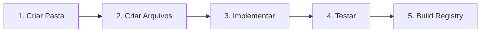

# 🛠️ Tutorial: Criando um Componente System (Personalizado)

> Este tutorial cobre o **Cenário 2**: Criar um componente totalmente personalizado.

## Visão Geral do Fluxo



---

## Passo 1: Criar a Estrutura de Pastas

```bash
mkdir -p components/system/meu-componente
```

Estrutura esperada:
```
components/system/meu-componente/
├── component.tsx    # Componente principal
├── index.ts         # Exports
├── styles.ts        # Estilos (opcional)
└── types.ts         # TypeScript types
```

---

## Passo 2: Criar os Arquivos

### `types.ts`
```typescript
export interface MeuComponenteProps {
    titulo: string;
    descricao?: string;
    variante?: 'default' | 'destacado';
}
```

### `styles.ts`
```typescript
export const styles = {
    container: "rounded-xl p-6 transition-all duration-200",
    variantes: {
        default: "bg-background border border-border",
        destacado: "bg-bg-primary text-fg-on-primary"
    },
    titulo: "text-lg font-semibold text-fg-main mb-2",
    descricao: "text-sm text-fg-secondary"
};
```

### `component.tsx`
```tsx
import React from 'react';
import { MeuComponenteProps } from './types';
import { styles } from './styles';
import { cn } from '@/lib/utils';

// Opcionalmente, consumir componentes UI do Shadcn
import { Button } from '@/components/ui/button';

export const MeuComponente: React.FC<MeuComponenteProps> = ({ 
    titulo, 
    descricao, 
    variante = 'default' 
}) => {
    return (
        <div className={cn(styles.container, styles.variantes[variante])}>
            <h3 className={styles.titulo}>{titulo}</h3>
            {descricao && <p className={styles.descricao}>{descricao}</p>}
            <Button className="mt-4">Ação</Button>
        </div>
    );
};
```

### `index.ts`
```typescript
export { MeuComponente } from './component';
export type { MeuComponenteProps } from './types';
```

---

## Passo 3: Testar Localmente

```tsx
// app/page.tsx
import { MeuComponente } from '@/components/system/meu-componente';

export default function Page() {
    return (
        <MeuComponente 
            titulo="Teste" 
            descricao="Funcionando!" 
            variante="destacado"
        />
    );
}
```

```bash
npm run dev
```

---

## Passo 4: Gerar o Registry

```bash
npm run build:components
```

**Output esperado:**
```
📦 System Component: meu-componente
🎉 Generated registry index with X items
```

O script automaticamente:
- Lê todos os arquivos `.ts` e `.tsx` da pasta
- Detecta dependências npm
- Detecta dependências de outros componentes UI
- Gera `public/registry/components/meu-componente.json`

---

## Passo 5: Verificar Integridade

```bash
npm run test:components
```

---

## Passo 6: Usar via CLI

Após publicar o CLI:

```bash
igreen add meu-componente
```

Os arquivos serão instalados em:
```
projeto-destino/
└── components/
    └── system/
        └── meu-componente/
            ├── component.tsx
            ├── index.ts
            ├── styles.ts
            └── types.ts
```

---

## Dicas Importantes

### Consumindo Componentes UI

Se seu componente usa `Button`:
```tsx
import { Button } from '@/components/ui/button';
```

O script detecta isso e adiciona `button` como `registryDependencies`.

### Consumindo Tokens

Use tokens semânticos diretamente nas classes:
```tsx
className="bg-bg-primary text-fg-on-primary"
```

### Estrutura Obrigatória

| Arquivo | Obrigatório? | Descrição |
|---------|--------------|-----------|
| `index.ts` | ✅ Sim | Exports públicos |
| `component.tsx` | ✅ Sim | Componente principal |
| `types.ts` | Recomendado | TypeScript types |
| `styles.ts` | Opcional | Estilos separados |
